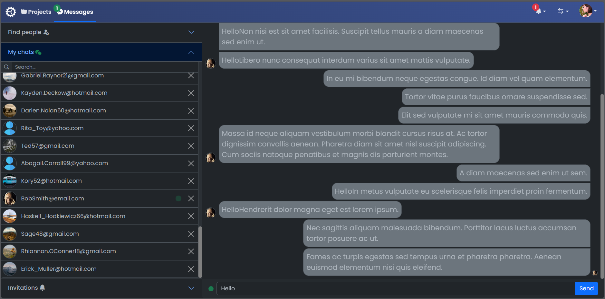
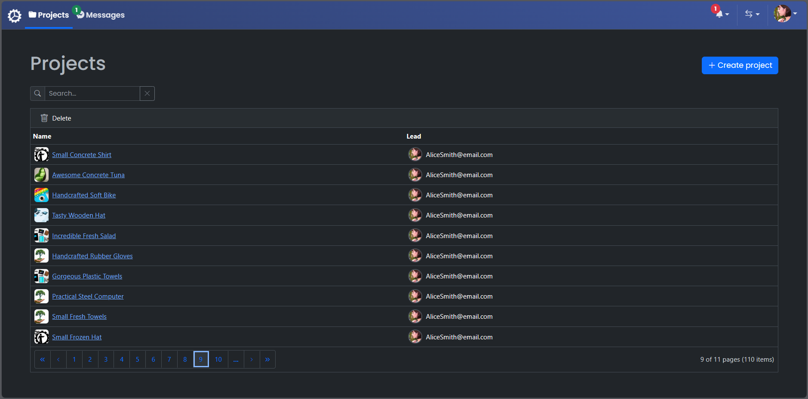
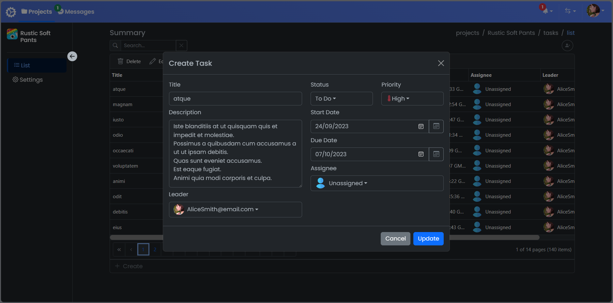

# Workflow
#### Project Management and Real-time Communication Application


The application was designed as a system for project management and real-time communication. It consists of microservices written using .NET. The user interface was created with Angular. The backend is covered with tests using XUnit. The project is currently under active development and will undergo further improvements.

## Features
- Live Chat: Enables users to engage in real-time conversations using SignalR, facilitating instant message exchange and information sharing.
- Simple Project Management System: Users can create projects, invite participants, and assign roles within them. Within each project, there is an option to define and allocate tasks to individual users, streamlining team coordination.
- Friend Addition: A social feature allowing users to add friends and build a contact network within the platform.
  
#### Live Chat 



#### Projects Page



#### Tasks Page 



## Architecture overview


- Microservices: The microservice-based architecture allows for independent expansion and updates of individual application components.
- Inter-service communication: Use of RabbitMQ and Azure Service Bus for reliable and scalable inter-service communication.
- Security and authentication: Integrated protection and identity management thanks to Duende Identity Server.
- Frontend: User interface based on Angular, served by the nginx server and styled with Bootstrap.
- Patterns: In all microservices, I have strived to follow the Clean Architecture pattern. Additionally, the "Projects" microservice implements a simplified DDD pattern. These aspects will be improved as I acquire new knowledge.
- Containerization: Docker was used in the project for containerization, simplifying the deployment and testing process, and ensuring environment consistency.

## Getting Started

- Make sure you have docker [installed](https://docs.docker.com/docker-for-windows/install/)
- Download the [Workflow-UI](https://github.com/KonradDzieciol99/WorkflowUI/) frontend
- Use the following commands in the root folder of both projects

```powershell
docker-compose build
docker-compose up
```

You should be able to browse different components of the application by using the below URLs :

```
Health Check : http://localhost:5018/
Seq :  http://localhost:5200/
Workflow :  http://localhost:1000/
```


